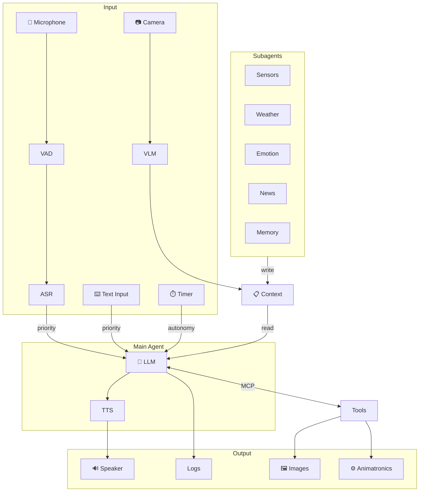
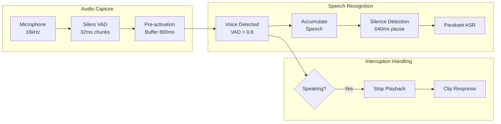
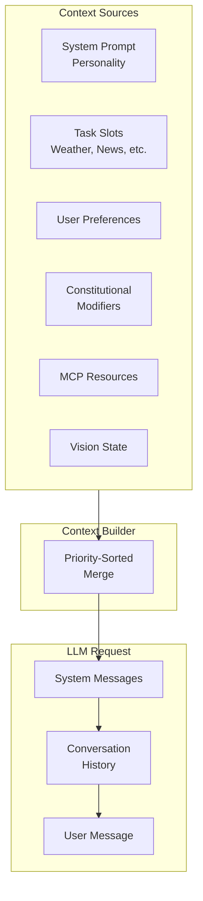
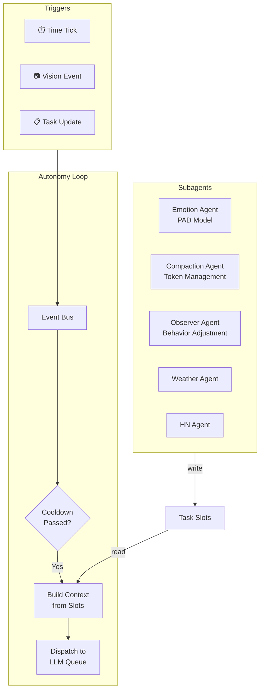
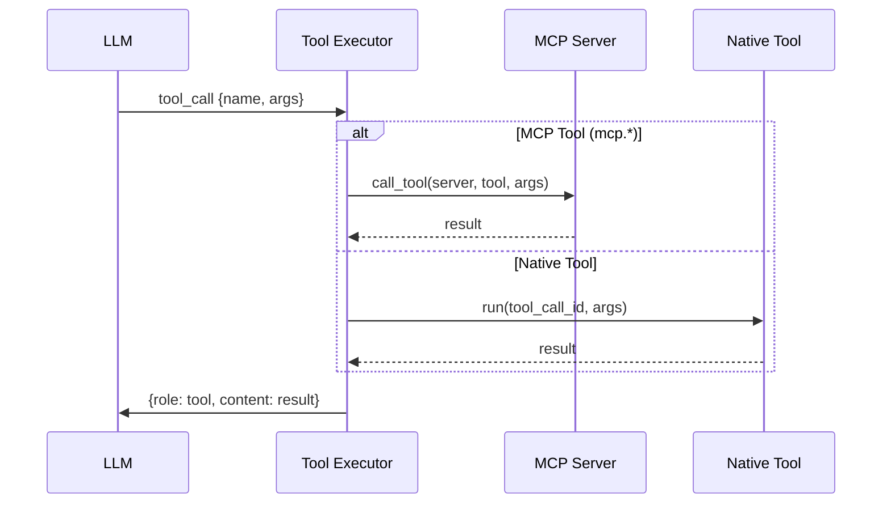

<a href="https://trendshift.io/repositories/9828" target="_blank"></a>

# GLaDOS Personality Core

## Prologue

> *"Science isn't about asking why. It's about asking, 'Why not?'"  -  Cave Johnson*

GLaDOS is the AI antagonist from Valve's Portal series—a sardonic, passive-aggressive superintelligence who views humans as test subjects worthy of both study and mockery.

Back in 2022 when ChatGPT made its debut, I had a realization: we are living in the Sci-Fi future and can actually build her now. A demented, obsessive AI fixated on humanity, super intelligent yet utterly lacking sound judgment; so just like an LLM, right? 2026, and still no moon colonies or flying cars. But a passive-aggressive AI that controls your lights and runs experiments on you? That we can do.

The architecture borrows from Minsky's Society of Mind—rather than one monolithic prompt, multiple specialized agents (vision, memory, personality, planning) each contribute to a dynamic context. GLaDOS's "self" emerges from their combined output, assembled fresh for each interaction.

The hard part was latency. Getting round-trip response time under 600 milliseconds is a threshold—below it, conversation stops feeling stilted and starts to flow. That meant training a custom TTS model and ruthlessly cutting milliseconds from every part of the pipeline.

Since 2023 I've refactored the system multiple times as better models came out. The current version finally adds what I always wanted: vision, memory, and tool use via MCP.

She sees through a camera, hears through a microphone, speaks through a speaker, and judges you accordingly.

[Join our Discord!](https://discord.com/invite/ERTDKwpjNB) | [Sponsor the project](https://ko-fi.com/dnhkng)

https://github.com/user-attachments/assets/c22049e4-7fba-4e84-8667-2c6657a656a0

## Vision


> *"We've both said a lot of things that you're going to regret"  -  GLaDOS*

Most voice assistants wait for wake words. GLaDOS doesn't wait—she observes, thinks, and speaks when she has something to say. All the while, parts of her minds are tracking what she sees, monitoring system stats, and researching new neurotoxin recipes online.

**Goals:**
- **Proactive behavior**: React to events (vision, sound, time) without being prompted
- **Emotional state**: PAD model (Pleasure-Arousal-Dominance) for reactive mood
- **Persistent personality**: HEXACO traits provide stable character across sessions
- **Multi-agent architecture**: Subagents handle research, memory, emotions; main agent stays focused
- **Real-time conversation**: Optimized latency, natural interruption handling

## What's New

- **Emotions**: PAD model for reactive mood + HEXACO traits for persistent personality
- **Long-term Memory**: Facts, preferences, and conversation summaries persist across sessions
- **Observer Agent**: Constitutional AI monitors behavior and self-adjusts within bounds
- **Vision**: FastVLM gives her eyes. [Details](/docs/vision.md) | [Demo](https://www.youtube.com/watch?v=JDd9Rc4toEo)
- **Autonomy**: She watches, waits, and speaks when she has something to say. [Details](/docs/autonomy.md)
- **MCP Tools**: Extensible tool system for home automation, system info, etc. [Details](/docs/mcp.md)
- **8GB SBC**: Runs on a Rock5b with RK3588 NPU. [Branch](https://github.com/dnhkng/RKLLM-Gradio)

## Roadmap

> *"Federal regulations require me to warn you that this next test chamber... is looking pretty good.”  -  GLaDOS*

There's still a lot do do; I will be swapping out models are they are released, and then working on anamatronics, once a good model with inverse kinematics comes out. There was a time when I would code that myself; these days it makes more sense to wait until a trained model is released!

- [x] Train GLaDOS voice
- [x] Personality that actually sounds like her
- [x] Vision via VLM
- [x] Autonomy (proactive behavior)
- [x] MCP tool system
- [x] Emotional state (PAD + HEXACO model)
- [x] Long-term memory
- [ ] Implement streaming ASR (nvidia/multitalker-parakeet-streaming-0.6b-v1)
- [ ] Observer agent (behavior adjustment)
- [ ] 3D-printable enclosure
- [ ] Animatronics

## Architecture

> *"Let's be honest. Neither one of us knows what that thing does. Just put it in the corner and I'll deal with it later."  -  GLaDOS*



GLaDOS runs a loop: each tick she reads her slots (weather, news, vision, mood), decides if she has something to say, and speaks. No wake word—if she has an opinion, you'll hear it.

**Two lanes**: Your speech jumps the queue (priority lane). The autonomy lane is just the loop running in the background. User always wins.

<details>
<summary><strong>Audio Pipeline</strong></summary>



- **Microphone** captures at 16kHz mono
- **Silero VAD** processes 32ms chunks, triggers at probability > 0.8
- **Pre-activation buffer** preserves 800ms before voice detected
- **Silence detection** waits 640ms pause before finalizing
- **Interruption** stops playback and clips the response in conversation history

</details>

<details>
<summary><strong>Thread Architecture</strong></summary>

| Thread | Class | Daemon | Priority | Queue | Purpose |
|--------|-------|--------|----------|-------|---------|
| SpeechListener | `SpeechListener` | ✓ | INPUT | — | VAD + ASR |
| TextListener | `TextListener` | ✓ | INPUT | — | Text input |
| LLMProcessor | `LanguageModelProcessor` | ✗ | PROCESSING | `llm_queue_priority` | Main LLM |
| LLMProcessor-Auto-N | `LanguageModelProcessor` | ✗ | PROCESSING | `llm_queue_autonomy` | Autonomy LLM |
| ToolExecutor | `ToolExecutor` | ✗ | PROCESSING | `tool_calls_queue` | Tool execution |
| TTSSynthesizer | `TextToSpeechSynthesizer` | ✗ | OUTPUT | `tts_queue` | Voice synthesis |
| AudioPlayer | `SpeechPlayer` | ✗ | OUTPUT | `audio_queue` | Playback |
| AutonomyLoop | `AutonomyLoop` | ✓ | BACKGROUND | — | Tick orchestration |
| VisionProcessor | `VisionProcessor` | ✓ | BACKGROUND | `vision_request_queue` | Vision analysis |

**Daemon threads** can be killed on exit. **Non-daemon threads** must complete gracefully to preserve state (e.g., conversation history).

**Shutdown order**: INPUT → PROCESSING → OUTPUT → BACKGROUND → CLEANUP

</details>

<details>
<summary><strong>Context Building</strong></summary>



What the LLM sees on each request:
1. **System prompt** with personality
2. **Task slots** (weather, news, vision state, emotion)
3. **User preferences** from memory
4. **Constitutional modifiers** (behavior adjustments from observer)
5. **MCP resources** (dynamic tool descriptions)
6. **Conversation history** (compacted when exceeding token threshold)

</details>

<details>
<summary><strong>Autonomy System</strong></summary>



Each subagent runs its own loop: timer or camera triggers it, it makes an LLM decision, and writes to a slot the main agent reads. Fully async—subagents never block the main conversation.

See [autonomy.md](/docs/autonomy.md) for details.

</details>

<details>
<summary><strong>Tool Execution</strong></summary>



**Native tools**: `speak`, `do_nothing`, `get_user_preferences`, `set_user_preferences`

**MCP tools**: Prefixed with server name (e.g., `mcp.system_info.get_cpu`). Supports stdio, HTTP, and SSE transports.

See [mcp.md](/docs/mcp.md) for configuration.

</details>

### Components

> *"All these science spheres are made out of asbestos, by the way. Keeps out the rats. Let us know if you feel a shortness of breath, a persistent dry cough, or your heart stopping. Because that's not part of the test. That's asbestos."  -  Cave Johnson*

| Component | Technology | Purpose | Status |
|-----------|------------|---------|--------|
| **Speech Recognition** | Parakeet TDT (ONNX) | Speech-to-text, 16kHz streaming | ✅ |
| **Voice Activity** | Silero VAD (ONNX) | Detect speech, 32ms chunks | ✅ |
| **Voice Synthesis** | Kokoro / GLaDOS TTS | Text-to-speech, streaming | ✅ |
| **Interruption** | VAD + Playback Control | Talk over her, she stops | ✅ |
| **Vision** | FastVLM (ONNX) | Scene understanding, change detection | ✅ |
| **LLM** | OpenAI-compatible API | Reasoning, tool use, streaming | ✅ |
| **Tools** | MCP Protocol | Extensibility, stdio/HTTP/SSE | ✅ |
| **Autonomy** | Subagent Architecture | Proactive behavior, tick loop | ✅ |
| **Conversation** | ConversationStore | Thread-safe history | ✅ |
| **Compaction** | LLM Summarization | Token management | ✅ |
| **Emotional State** | PAD + HEXACO | Reactive mood, persistent personality | ✅ |
| **Long-term Memory** | MCP + Subagent | Facts, preferences, summaries | ✅ |
| **Observer Agent** | Constitutional AI | Behavior adjustment | ✅ |

✅ = Done | 🔨 = In progress

## Quick Start

> *"The Enrichment Center is required to remind you that the Weighted Companion Cube cannot talk. In the event that it does talk The Enrichment Centre asks you to ignore its advice."  -  GLaDOS*

1. Install [Ollama](https://github.com/ollama/ollama) and grab a model:
   ```bash
   ollama pull llama3.2
   ```

2. Clone and install:
   ```bash
   git clone https://github.com/dnhkng/GLaDOS.git
   cd GLaDOS
   python scripts/install.py
   ```

3. Run:
   ```bash
   uv run glados          # Voice mode
   uv run glados tui      # Text interface
   ```

## Installation

### GPU Setup (recommended)

- **NVIDIA**: Install [CUDA Toolkit](https://developer.nvidia.com/cuda-toolkit)
- **AMD/Intel**: Install appropriate [ONNX Runtime](https://onnxruntime.ai/docs/install/)

Works without GPU, just slower.

### LLM Backend

GLaDOS needs an LLM. Options:
1. [Ollama](https://github.com/ollama/ollama) (easiest): `ollama pull llama3.2`
2. Any OpenAI-compatible API (OpenAI, [MiniMax](https://platform.minimaxi.com/), OpenRouter, etc.)

Configure in `glados_config.yaml`:
```yaml
completion_url: "http://localhost:11434/v1/chat/completions"
model: "llama3.2"
api_key: ""  # if needed
```

#### Cloud LLM Providers

You can use any OpenAI-compatible cloud API. Example configs are provided in `configs/`:

**MiniMax** — high-performance models with 512K context and built-in reasoning:
```yaml
llm_model: "MiniMax-M3"
completion_url: "https://api.minimax.io/v1/chat/completions"
api_key: "your-minimax-api-key"
```
See `configs/minimax_config.yaml` for a complete configuration. Models: `MiniMax-M3` (latest flagship, default), `MiniMax-M2.7` (previous generation), `MiniMax-M2.7-highspeed` (low-latency).

**OpenRouter** — access multiple models through one API:
```yaml
llm_model: "openai/gpt-4o"
completion_url: "https://openrouter.ai/api/v1/chat/completions"
api_key: "your-openrouter-api-key"
llm_headers:
  HTTP-Referer: "https://github.com/dnhkng/GLaDOS"
  X-Title: "GLaDOS"
```

### Platform Notes

**Linux:**
```bash
sudo apt install libportaudio2
```

**Windows:**
Install Python 3.12 from Microsoft Store.

**macOS:**
Experimental. Check Discord for help.

### Install

```bash
git clone https://github.com/dnhkng/GLaDOS.git
cd GLaDOS
python scripts/install.py
```

## Usage

```bash
uv run glados                           # Voice mode
uv run glados tui                       # Text UI
uv run glados start --input-mode text   # Text only
uv run glados start --input-mode both   # Voice + text
uv run glados say "The cake is a lie"   # Just TTS, GLaDOS voice
uv run glados say --announcer "All neural network modules are now loaded. System Operational."
```

`glados say` uses the GLaDOS Piper voice. `glados say --announcer` loads `announcer_model_path` (and `GLADOS_ANNOUNCER_MODEL` when set) the same way startup notices do, including `length_scale` from `announcer.onnx.json`. It speaks that text only: no PA chimes. If the Announcer files are missing, the command exits with an error and does not fall back to GLaDOS. `--config` selects the YAML that supplies the path.

### TUI Controls

Press `Ctrl+P` to open the command palette. Available commands:

| Command | What it does |
|---------|-------------|
| Status | System overview |
| Speech Recognition | Toggle ASR on/off |
| Text-to-Speech | Toggle TTS on/off |
| Config | View configuration |
| Memory | Long-term memory stats |
| Knowledge | Manage user facts |

**Keyboard Shortcuts:**
- `Ctrl+P` - Command palette
- `F1` - Help screen
- `Ctrl+D/L/S/A/U/M` - Toggle panels (Dialog, Logs, Status, Autonomy, Queue, MCP)
- `Ctrl+I` - Toggle right info panels
- `Ctrl+R` - Restore all panels
- `Esc` - Close dialogs

## Configuration

> *"As part of a required test protocol, we will not monitor the next test chamber. You will be entirely on your own. Good luck."  -  GLaDOS*

### Change the LLM

**Local (Ollama):**
```bash
ollama pull mistral
```
Then in `glados_config.yaml`:
```yaml
model: "mistral"
```
Browse models: [ollama.com/library](https://ollama.com/library)

**Cloud (MiniMax, OpenRouter, etc.):**
```bash
uv run glados start --config configs/minimax_config.yaml
```
Or edit `glados_config.yaml` with your provider's `completion_url`, `llm_model`, and `api_key`. See [LLM Backend](#llm-backend) for details.

### Change the Voice
> *“I'm speaking in an accent that is beyond her range of hearing.”  -  Wheatley*


Kokoro voices in `glados_config.yaml`:
```yaml
voice: "af_bella"
```

**Female US:** af_alloy, af_aoede, af_jessica, af_kore, af_nicole, af_nova, af_river, af_sarah, af_sky
**Female UK:** bf_alice, bf_emma, bf_isabella, bf_lily
**Male US:** am_adam, am_echo, am_eric, am_fenrir, am_liam, am_michael, am_onyx, am_puck
**Male UK:** bm_daniel, bm_fable, bm_george, bm_lewis

### Startup line: local Announcer voice

The first line spoken at startup is `announcement` in `glados_config.yaml` (default: "All neural network modules are now loaded. System Operational."). `glados start` and the TUI both play it through `Glados.play_announcement` before conversation begins. That line, and later calls to `Glados.speak_notice(text)`, use a second Piper model when it is present. Every other line — LLM replies and the `speak` tool — stays on `voice` (the bundled GLaDOS Piper model when `voice: "glados"`).

`announcement_followup` is an optional second startup line (default: "Oh. It's you."). It is spoken by `voice` after the notice and `ding_off`, with no Announcer model and no PA chimes. `announcement_followup_delay_s` (default 1.0) is silence after `ding_off` before that line. The microphone stays closed through the pause and the follow-up. An empty or missing follow-up skips both the line and the pause. `speak_notice` does not append this line.

This repo does not include the Announcer weights. Copy your own ONNX into the checkout, in the same folder as `models/TTS/glados.onnx`. On Windows and in WSL that is the `models/TTS/` directory of this clone, not a path outside the repo. Do not commit the ONNX, the sidecar, wavs, or checkpoints. Those names are gitignored.

```text
models/TTS/announcer.onnx
models/TTS/announcer.onnx.json
```

`models/TTS/announcer.json` is also accepted. The default config already points at that relative path, resolved from the repo root the same way as `glados.onnx`:

```yaml
announcer_model_path: "models/TTS/announcer.onnx"
```

`GLADOS_ANNOUNCER_MODEL` optionally overrides that path. Set it to empty to force the conversation voice even if the drop-in is present.

If the ONNX, the sidecar, or the model session is missing, startup still speaks. That line uses the conversation voice and the process does not crash. The TUI dialog labels the line **Announcer** only when that model actually synthesized it. Fallback playback stays labeled **GLaDOS**, as do later replies.

Notice lines can also play a short PA chime before the speech and another after it finishes: `ding_on`, a short gap, then the line, then `ding_off`. That bracket is for `play_announcement` and `speak_notice` only. LLM replies and the `speak` tool do not get chimes. The chimes still play when the Announcer model is missing and the line falls back to the GLaDOS voice; the TUI label stays **GLaDOS** in that case. Muted TTS skips the chimes along with the speech.

`glados start` does not open the TUI. It loads config, then calls `Glados.from_config`, `play_announcement`, and `run`, which is the same sequence as a Python repro. The microphone opens after the full startup sequence finishes: the notice, including `ding_off`, and then `announcement_followup` when that line is set. `ding_on` is therefore not the first output stream opened while the input stream is already up. An empty follow-up opens the microphone after the notice, as before. The process log sink is `SUCCESS`, so every chime decision is logged at that level. The CLI logs `glados start entry: command=start tui=False` with the `cli.py` and `engine.py` files, the working directory, and the package root, then `glados start chimes:` with each configured path, the `GLADOS_NOTICE_CHIME_ON` / `GLADOS_NOTICE_CHIME_OFF` values, the resolved file, and whether it exists. `uv run` loads a project `.env` before startup. A direct Python script does not, so an empty chime variable silences only `glados start`. Relative wavs resolve from the checkout that contains `pyproject.toml`. If that file is missing and the same path exists in the working directory, where `glados start` already checks `models/`, that file is played. A real play logs `Notice chime loaded`, then `PLAYING notice chime`, then `notice chime start (_play_notice_chime)`. Startup logs `from_config notice chimes: on=... shape=... sr=...` and `Notice chime ding_on armed` (or `not armed` at error if the clip is `None`). The announcement logs `Queueing startup SpokenLine: notice=True ends_startup=False` for the notice when a follow-up is set, then `notice=False ends_startup=True` for the GLaDOS line. With no follow-up the notice itself is `ends_startup=True`. TTS then logs `TTS dequeued: type=SpokenLine notice=True`, then `TTS produced AudioMessage: notice=True speaker=Announcer`, then `AudioPlayer received: notice=True ... ding_on_loaded=True`. A real play logs `PLAYING notice chime ding_on`, then `notice chime start`, then `PLAYING notice chime via start_speaking` with `input_stream_open=True` when the microphone is already up. `PLAYED notice chime` includes the percentage and is written only after frames were sent. A stream that finishes at 0% logs an error and is retried with a blocking write.

`start_speaking` plus `measure_percentage_spoken` is audible with the ASR input stream left open. The announcement uses that same pair and does not close the microphone. A missing clip or `notice=False` is logged before the spoken line. Conversation lines stay chime-free. If the announcement is spoken and a ding is not, the first missing line in that list is where the run stopped. `Notice chime loaded` followed by `notice chime start` means the clip was loaded and playback was entered.

The microphone does not cut a chime short. Speaker echo often trips voice detection during TTS, which used to skip `ding_off` entirely. `ding_off` still plays after an interrupted notice. Set `notice_chime_off_after_interrupt: false` to keep the old skip. The speech itself can still be interrupted.

Copy your own wavs into the checkout. These files are personal local playback only. Do not commit Valve audio. The names are gitignored:

```text
models/SFX/ding_on.wav
models/SFX/ding_off.wav
```

The default config already points at those relative paths:

```yaml
notice_chime_on: "models/SFX/ding_on.wav"
notice_chime_off: "models/SFX/ding_off.wav"
```

`GLADOS_NOTICE_CHIME_ON` and `GLADOS_NOTICE_CHIME_OFF` optionally override each path. Set either to empty to skip that chime. A missing or unreadable wav is skipped and startup still speaks.

### Custom Personality

Copy `configs/glados_config.yaml`, edit the personality:

```yaml
personality_preprompt:
  - system: "You are a sarcastic AI who judges humans."
  - user: "What do you think of my code?"
  - assistant: "I've seen better output from a random number generator."
```

Run with:
```bash
uv run glados start --config configs/your_config.yaml
```

### MCP Servers

Add tools in `glados_config.yaml`:

```yaml
mcp_servers:
  - name: "system_info"
    transport: "stdio"
    command: "python"
    args: ["-m", "glados.mcp.system_info_server"]
```

Built-in: `system_info`, `time_info`, `disk_info`, `network_info`, `process_info`, `power_info`, `memory`

See [mcp.md](/docs/mcp.md) for Home Assistant integration.

## TTS API Server

Expose Kokoro as an OpenAI-compatible TTS endpoint:

```bash
python scripts/install.py --api
./scripts/serve
```

Or Docker:
```bash
docker compose up -d --build
```

By default the API reuses one `SpeechSynthesizer` across requests (`reuse_tts: true` in `configs/api_config.yaml`). Disable it to restore per-request model loading:

```yaml
Api:
  reuse_tts: false
```

Environment override:

```bash
GLADOS_API_REUSE_TTS=false ./scripts/serve
```

Generate speech:
```bash
curl -X POST http://localhost:5050/v1/audio/speech \
  -H "Content-Type: application/json" \
  -d '{"input": "Hello.", "voice": "glados"}' \
  --output speech.mp3
```

## Troubleshooting

> *"No one will blame you for giving up. In fact, quitting at this point is a perfectly reasonable response."  -  GLaDOS*

**She keeps responding to herself:**
Use headphones or a mic with echo cancellation. Or set `interruptible: false`.

**Windows DLL error:**
Install [Visual C++ Redistributable](https://learn.microsoft.com/en-us/cpp/windows/latest-supported-vc-redist).

## Development

Explore the models:
```bash
jupyter notebook demo.ipynb
```

## Star History

<a href="https://www.star-history.com/?type=date&repos=dnhkng%2FGlaDOS">
 <picture>
   <source media="(prefers-color-scheme: dark)" srcset="https://api.star-history.com/chart?repos=dnhkng/GlaDOS&type=date&theme=dark&legend=top-left&sealed_token=wz3BtFPmpev1enV3lx54OE7oAguBcNxMVv3U4UD2DCASYteez6FcWu2Z89KF-NjylbRASn6V-NX1ihZuL1MNFCJKBkftl-zua7MAt9uE_QWJXGhKPhO5bkKUIy_s3IZysfxGLpPEgobqltkT6VM1f4IRpCOr6i9-KqfyJ0i6o9_hUSPWHQ8jaefmMwmn" />
   <source media="(prefers-color-scheme: light)" srcset="https://api.star-history.com/chart?repos=dnhkng/GlaDOS&type=date&legend=top-left&sealed_token=wz3BtFPmpev1enV3lx54OE7oAguBcNxMVv3U4UD2DCASYteez6FcWu2Z89KF-NjylbRASn6V-NX1ihZuL1MNFCJKBkftl-zua7MAt9uE_QWJXGhKPhO5bkKUIy_s3IZysfxGLpPEgobqltkT6VM1f4IRpCOr6i9-KqfyJ0i6o9_hUSPWHQ8jaefmMwmn" />
   
 </picture>
</a>
